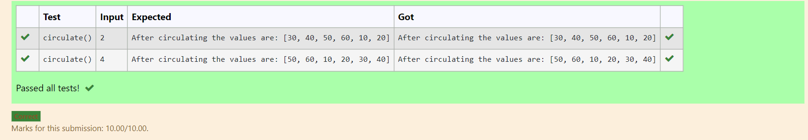

# Circulate-the-values-of-N-variables
## Aim:
To write a python program to circulate the n variables using function concept
## Equipment’s required:
PC
Anaconda - Python 3.7
## Algorithm: 
### Step 1: 
Create a function to rotate a list of elements
### Step 2: 
Define a list of elements
### Step 3: 
Get the value from the user for the number of rotation
### Step 4: 
Using the slicing concept rotate the list
### Step 5: 
Print the result list the values would be circulated according to the number of rotation value given by the user
### Step 6: 
End the program
## Program:
```
#Program to circulate N values.
#Developed by: Shrruthilaya G 
#RegisterNumber: 21002893
def circulate():
    l=[10,20,30,40,50,60]
    n=int(input())
    result=l[n: ]+l[ :n]
    print("After circulating the values are:", result)
```

## Output:


## Result:
The values are circulated and executed successfully.